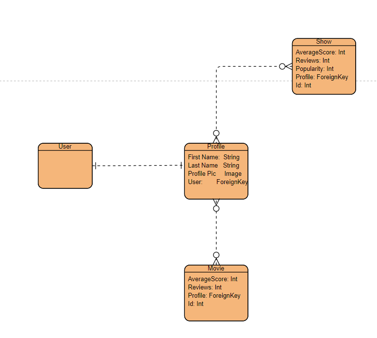

# Premier

## About

Premier is a website where users will be able to look up information on specific movies, read reviews, scores, and also make their own reviews if they have an account.
Live: https://premier-min.herokuapp.com/

## Technologies Used

HTML, CSS, Javascript, React.js, Django, Python, Materialize.css

## User Stories

### Home Page

A user should be able to go into the home page and immediately see a navbar with signup, login, logo, movie, and TV index links. There should also be some random movies showing up which are also links directly to the page associated with it.

A user should be able to sign up with an email address, a username, and a password. Profile pictures are optional.

When a user is logged in the navbar should change slighly by having the login/signup links replaced with log out and profile links.

### Movie/Show Index

Movies/Shows should appear and it should also be paginated with 20 movies as the limit per page.

There should be a side nav that is used to filter what kind of movies will appear.

The title, average rating, and poster of the movies/shows should appear and be links to their respective pages to show more details

### Movie/Show Details

Movies/Shows should be have the title, poster art, a tagline, an overview, an average rating, number of ep, number of seasons, a trailer and the newtworks it is available to watch in.

There should be a review section where users can submit their score and reviews.

Only a logged in user can add, edit and delete their own reviews and scores.

A logged in user can also add it to their movie or show recommendations

### Profile Page

Users should be able to see their profile details like name, email, and profile picture and edit them if they are the owner

You should also be able to see a list of recommendations even if you are not logged in which are all linked to their details pages.

### Profile Index Page

Users are are able to pick and choose the profile they would like to see and they can view others peoples profiles and recommendations

## ERD

## Wireframes

### Home Page

### Index Page

## Details Page

## Profile Page

